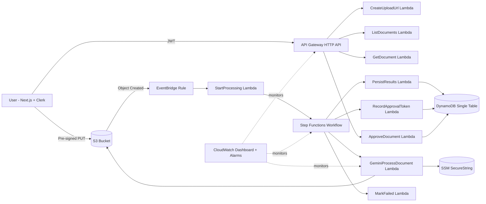

# DocuPilot

A serverless, production-style document processing system that combines AI extraction with human approval. Users upload files directly to S3, workflows run asynchronously on AWS, and the dashboard tracks every state from upload to final approval.

## Live Demo
- Frontend: `https://docu-pilot-client.vercel.app/`
- Demo video: `<ADD_LOOM_OR_YOUTUBE_LINK>`

## Product Preview
- Screenshot: `docs/assets/dashboard-screenshot.png` *(placeholder)*
- GIF walkthrough: `docs/assets/demo.gif` *(placeholder)*

## Architecture


## Features
- Clerk-authenticated dashboard with protected routes.
- Direct browser-to-S3 uploads via pre-signed URLs.
- Event-driven backend orchestration with Step Functions.
- Gemini-powered extraction (summary, classification, extracted fields).
- Human-in-the-loop approval queue with explicit callback handling.
- Real-time-ish status updates via dashboard polling.
- Per-document audit timeline (upload, processing, approval, failure events).
- CloudWatch dashboard + alarms for Lambda, Step Functions, and API 5xx.

## Tech Stack
- **Frontend:** Next.js (App Router), React, TypeScript, Tailwind, Clerk
- **Backend:** AWS SAM, Lambda (Node.js 22), API Gateway HTTP API
- **Data/Storage:** DynamoDB (single-table), S3
- **Orchestration:** Step Functions, EventBridge
- **AI:** Gemini via `@google/generative-ai`
- **Observability:** CloudWatch Logs, Dashboard, Alarms
- **Testing:** Vitest (serverless unit tests)

## Local Setup
### 1) Install dependencies
```bash
npm install
npm install --workspace client
npm install --workspace serverless
```

### 2) Configure client env
Create `client/.env.local` from example:
```bash
cp client/.env.local.example client/.env.local
```

Set values:
- `NEXT_PUBLIC_CLERK_PUBLISHABLE_KEY`
- `CLERK_SECRET_KEY`
- `NEXT_PUBLIC_API_BASE_URL`

### 3) Run frontend
```bash
npm run dev:client
```
Open `http://localhost:3000`.

## AWS Deployment (SAM)
From `serverless/`:
```bash
sam validate -t template.yaml
sam build
sam deploy --guided --profile <aws-profile> --region <region>
```

Provide parameters during guided deploy:
- `Stage`
- `ClerkIssuer`
- `ClerkAudience` (typically `docupilot-api`)
- `GeminiApiKeyParameterName` (example: `/docupilot/dev/GEMINI_API_KEY`)

## Environment Variables
### Client
- `NEXT_PUBLIC_CLERK_PUBLISHABLE_KEY`
- `CLERK_SECRET_KEY`
- `NEXT_PUBLIC_API_BASE_URL`

### Serverless (Lambda env via SAM)
- `DOCUMENTS_TABLE`
- `DOCUMENTS_BUCKET`
- `GEMINI_API_KEY_PARAMETER`
- `MOCK_GEMINI`
- `GEMINI_MODEL`

## API Overview
- `POST /uploads` → create upload target + initial document record
- `GET /documents` → list current user documents
- `GET /documents/{documentId}` → fetch one document details
- `POST /documents/{documentId}/approval` → approve/reject pending document

See full contracts: `docs/api-contracts.md`.

## Monitoring
- CloudWatch dashboard: `docupilot-${Stage}`
- Alarms:
  - key Lambda errors
  - Step Functions failed executions
  - API Gateway 5xx

Operational guide: `docs/deployment.md`.

## Testing
Serverless tests:
```bash
npm run test --workspace serverless
```

Type checks:
```bash
npm run typecheck:serverless
npm run build:client
```

## Limitations
- Current workflow supports a single approval stage.
- Polling-based UI updates (no websockets/SSE yet).
- Extraction quality depends on document quality and model output consistency.
- No tenant-level hard isolation beyond user-partitioned keys.

## Future Improvements
- Multi-step approval policies and role-based access.
- Webhook/SSE-driven live updates instead of polling.
- Idempotency keys + stronger workflow replay protections.
- Richer audit/event trail for compliance use cases.
- Broader test coverage (integration + contract tests).

## CV Bullet Examples
- Built a serverless AI document workflow using **Next.js + AWS SAM + Step Functions + DynamoDB**, enabling secure upload, extraction, and human approval.
- Implemented **event-driven orchestration** from S3 object events to AI processing with robust status tracking and failure handling.
- Designed and shipped **JWT-protected APIs** with Clerk authorizer and user-scoped DynamoDB access patterns.
- Added **operational observability** with CloudWatch dashboards/alarms across Lambda, API Gateway, and Step Functions.
