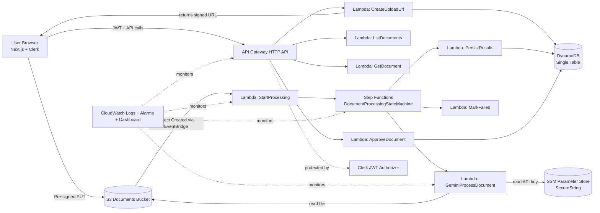

# Architecture

## Overview
DocuPilot is a serverless document pipeline on AWS with a Next.js frontend. Users upload documents directly to S3 using pre-signed URLs, processing is orchestrated by Step Functions, AI extraction is handled by Gemini through Lambda, and final review happens in an approval queue. DynamoDB stores the full document lifecycle in a single table design, including an append-only audit timeline (`documentEvents`) per document.

## Architecture Diagram

## AWS Services
- **API Gateway (HTTP API)**: Public API surface for upload URL creation, listing documents, fetching details, and approve/reject actions.
- **Lambda**: Stateless compute for all backend actions (upload URL, list/get documents, start processing, Gemini extraction, persistence, approval callback, failure marking).
- **S3**: Durable storage for original uploaded documents.
- **EventBridge**: Routes S3 object-created events to processing start Lambda.
- **Step Functions**: Workflow orchestration for processing steps, retries, and failure transitions.
- **DynamoDB**: Single-table persistence for document metadata, status, extracted results, and audit timeline events.
- **SSM Parameter Store (SecureString)**: Stores Gemini API key and injects secure runtime access.
- **CloudWatch**: Logs, alarms, and dashboard for ops visibility.

## Upload Flow
1. Frontend requests `POST /uploads` with Clerk token.
2. `CreateUploadUrl` validates input, creates `documentId`, writes initial DynamoDB record (`UPLOADING`), and returns pre-signed S3 URL.
3. Browser uploads file directly to S3 (backend not in file transfer path).
4. S3 object creation event triggers EventBridge rule.
5. Document audit event is recorded: `UPLOAD_REQUESTED`, then `FILE_UPLOADED`.

## Processing Flow
1. EventBridge invokes `StartProcessing` Lambda.
2. Lambda parses S3 key (`uploads/{userId}/{documentId}/{fileName}`), marks document as processing context, and starts Step Functions execution.
3. State machine invokes `GeminiProcessDocument`:
   - Reads file from S3.
   - Reads Gemini API key from SSM.
   - Sends document to Gemini and validates strict JSON output with Zod.
4. State machine invokes `PersistResults` to store summary/classification/extracted fields and sets status to `AI_COMPLETED`.
5. State machine stores callback token via `RecordApprovalToken`, transitions status to `NEEDS_APPROVAL`, and records `APPROVAL_REQUESTED`.
6. If any processing state fails, catch path invokes `MarkFailed` and status becomes `FAILED`.

## Approval Flow
1. Dashboard polls `/documents` and derives approval queue from `status === NEEDS_APPROVAL`.
2. Reviewer clicks Approve/Reject.
3. Frontend sends `POST /documents/{documentId}/approval`.
4. `ApproveDocument` Lambda verifies ownership and current status, optionally sends Step Functions task callback if token exists, and updates DynamoDB status to `APPROVED` or `REJECTED`.
5. Frontend refetches documents and updates queue immediately.
6. Approval decisions are recorded in timeline events (`APPROVED` / `REJECTED`).

## DynamoDB Single-Table Design
- **Table keys**:
  - `PK = USER#{userId}`
  - `SK = DOC#{documentId}`
- **Core attributes**:
  - `status`, `bucket`, `key`, `createdAt`, `updatedAt`
  - `summary`, `classification`, `extractedText`, `extractedFields`
  - `approvalComment`, `errorMessage`, optional `taskToken`
  - `documentEvents` (ordered lifecycle audit entries)
- **Access patterns**:
  - List documents for user: `Query PK = USER#{userId}`
  - Get one document: `GetItem PK + SK`

## Security Model
- Clerk JWT authorizer enforced at API Gateway.
- Backend additionally validates user identity from JWT claims.
- Users can only read/update records in their own partition (`USER#{userId}`).
- Browser uploads use short-lived pre-signed URLs; no long-lived S3 credentials in client.
- Gemini API key is never hardcoded; retrieved from SSM SecureString at runtime.
- Logs avoid secrets and full document payloads.

## Failure Handling
- Step Functions retries transient Lambda failures with backoff.
- Workflow catch path marks records `FAILED` for user visibility.
- Approval callback failures (invalid/expired task token) return clear `409` conflicts.
- Schema validation and JSON parse errors from Gemini are surfaced as structured errors.
- CloudWatch alarms cover Lambda errors, Step Functions failures, and API 5xx spikes.

## Future Improvements
- Add dead-letter queues and redrive strategy for asynchronous failure recovery.
- Add idempotency keys and conditional writes for stronger exactly-once behavior.
- Add per-tenant encryption context and stricter IAM condition keys.
- Add OpenTelemetry/X-Ray traces across API -> Lambda -> Step Functions.
- Add approval SLA metrics (time-to-review) and richer operational dashboards.
- Add document versioning and audit trail events for compliance workloads.
